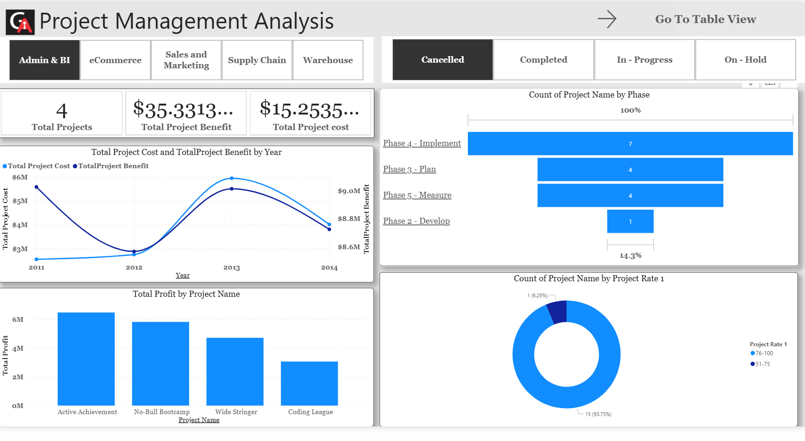
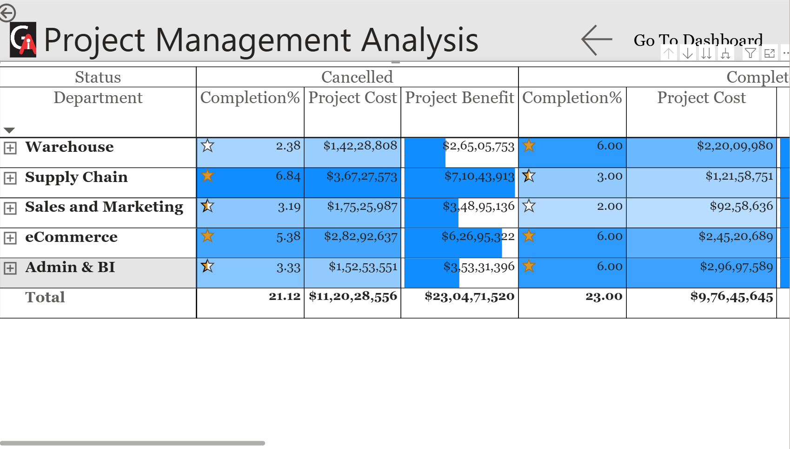

# Project-Management-Analysis-Using-Power-BI

## Project Description
This project focuses on analyzing project performance using an interactive dashboard. The objective of this project is to provide insights into project cost, project benefit, project phases, and profitability across different departments.

The dashboard helps stakeholders monitor project progress, identify high-profit projects, and understand project distribution across different phases and departments.

## Tools Used
- Power BI
- Data Visualization
- Data Analysis
- DAX

## Key Insights
- Total number of projects
- Total project cost
- Total project benefit
- Project distribution by phases
- Profit analysis by project name
- Project performance by department

## Tasks Performed
1. Analyzed **Total Project Cost and Total Project Benefit by Year in each Department**.
2. Visualized **Total Projects by Project Phases**.
3. Identified **Top 7 Projects by Project Benefit in each Project Type by Status**.
4. Calculated **Total Projects in each Process Rate**.
5. Identified **Top 10 Projects and Project Descriptions by Profit**.

### DAX Calculations
- Process Rate (Column Switch)
- Profit Measure = Project Benefit - Project Cost

## Dashboard Features
- Department filtering (Admin & BI, eCommerce, Sales and Marketing, Supply Chain, Warehouse)
- Project status filters (Cancelled, Completed, In-Progress, On-Hold)
- Cost vs Benefit comparison
- Profit analysis for projects

## Views Included

### Dashboard View
Provides a visual summary of project performance using charts and KPIs.

### Table View
Shows detailed project metrics including completion percentage, project cost, and project benefit across departments.

## Business Value
This dashboard helps organizations:
- Monitor project performance
- Identify profitable projects
- Improve project planning and decision-making

## Project Preview
## Dashboard Preview

## Table View

## Author
Shrikant Jarande
